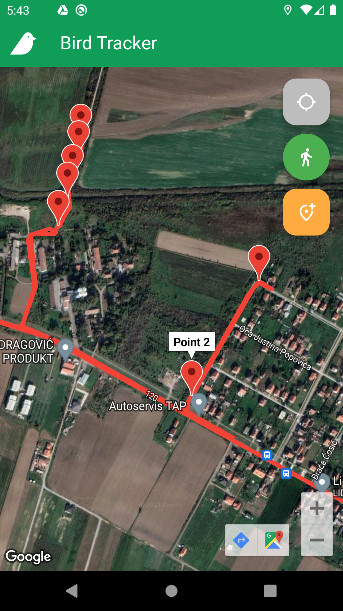
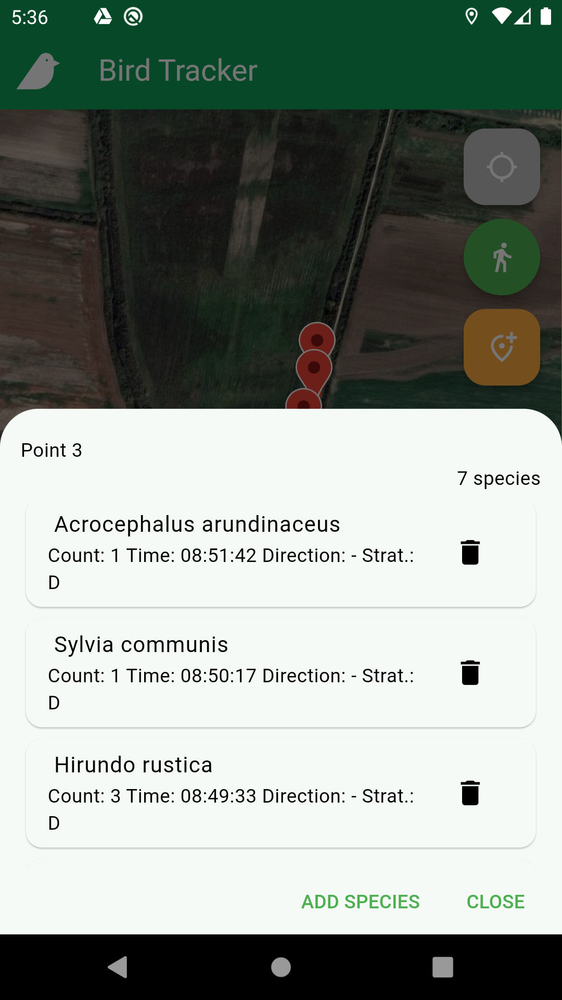
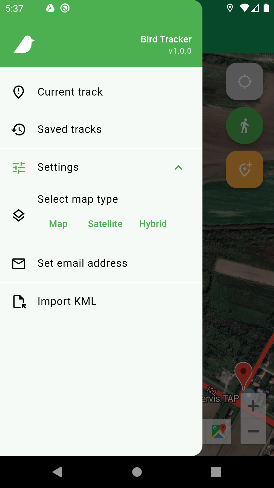
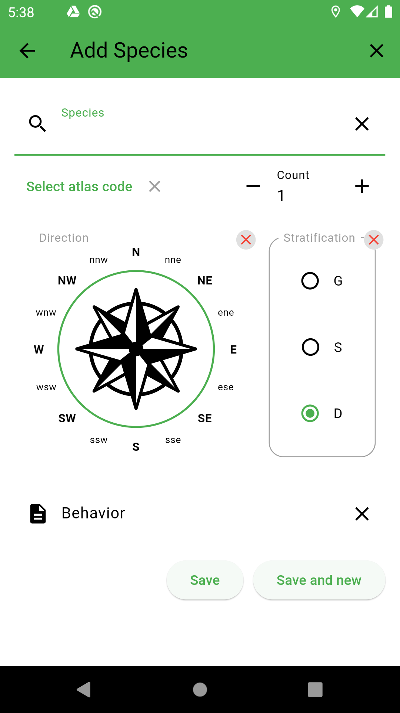

# Bird Tracker App

The Bird Tracker App is a Flutter-based Android application designed for bird watchers to track their bird-watching activities, mark bird sightings on a map, and save important data related to the observed birds. This app provides a convenient and organized way for bird watchers to record their sightings, including location, time, number of birds, flying direction, stratification, and more.

## Features

- **Map Markers**: Add markers on the map to indicate the locations where you have observed birds.
- **Marker Data**: Attach various data to each marker, such as the number of birds, flying direction, stratification, and other relevant details.
- **Track Recording**: Start a track recording session to record your bird-watching activities and add markers along the way.
- **Pause and Finish Track**: Pause or finish your track recording session as per your convenience.
- **Track History**: Access and view your previously recorded tracks to review or edit them.
- **Export and Import**: Export and import data in KML format to easily share or back up your tracks and markers.
- **Share Track Data**: Share your track data with others by exporting it as an XLSX file, allowing them to view your bird-watching experiences.

## Installation

To use the Bird Tracker App, follow these steps:

1. Clone the repository: `git clone https://github.com/your-username/your-repo.git`.
2. Open the project in your preferred Flutter development environment (e.g., Android Studio, Visual Studio Code).
3. Install dependencies by running `flutter pub get` in the terminal.
4. Connect an Android device or set up an emulator.
5. Build and run the app using `flutter run`.

## Screenshots

Include a few screenshots of your app to showcase its user interface and functionality. For example:

{: width="50%"}
_Main screen._

_Track info._

_Options._

_Add spices form._

## Contributing

Contributions to the Bird Tracker App are welcome! If you have any ideas, suggestions, or bug reports, please open an issue or submit a pull request.

## License

This project is licensed under the [MIT License](LICENSE).
